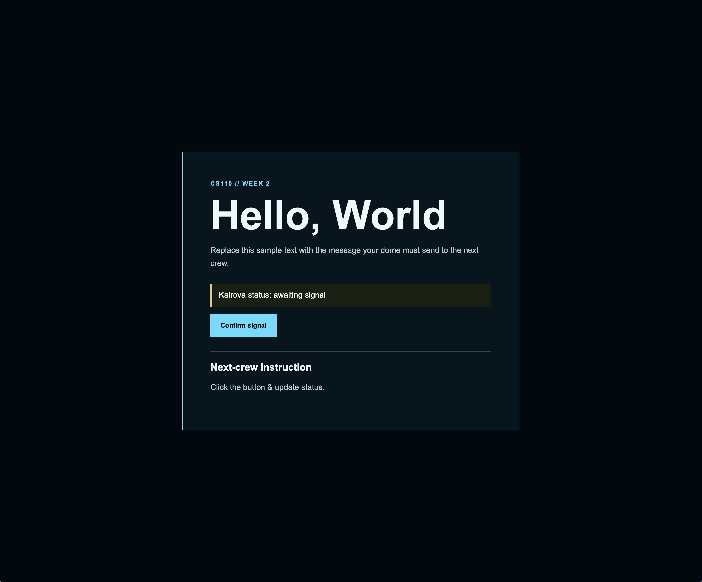

# Dome Signal Starter

## Project description
- Dome Signal is a webpage built for checking Kairova status.
- Uses HTML, CSS, and JavaScript.
- Responsive styling with JS to update Kairova status on click.
- Features readable and accessible UI/UX.

# Awaiting status

# Online status

